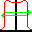

.. index:: 
   single: Parameters; 1D Symmetry Ave

1D Symmetry Ave
===============

The point difference (also called maximum variation) is the maximum absolute difference between the left and right profile values at the same distance from the profile or detector centre taken over the :ref:`in field area<In Field Area>` (IFA) normalised to the average of the IFA:

.. math:: 100 \cdot \cfrac {|P(dL) - P(dR)|} {ave}
   
for *dR* = -*dL* from 0 to the the edge of the :ref:`in field area<In Field Area>`.

**Protocol invocation name**: 1D Symmetry Ave

|Note| The point difference symmetry may be affected by the field or detector centre. If the field is slightly offset you can use the Centre field tool |CentreField| to correct any offset.

.. |Note| image:: _static/Note.png

