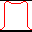

.. index:: 
   pair: Toolbar; Normalise to MAX

Normalise to MAX
================

Clicking the "Normalise to MAX" button |normmax| normalises the image so that the maximum of the image is 100 and the minimum is zero using the formula:

.. math:: NZ = \cfrac {(Z - min)*100} {max - min}

Where *max* and *min* are the image maximum and minimum respectively. *Z* is the current pixel value and *NZ* is the new pixel value. Clicking the button again will remove the normalisation.

