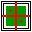
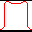
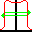

.. index:: Toolbar

The Tool Bar
==============

The tool bar provides some shortcuts to the :ref:`Menu Bar<The Menu Bar>` functions as well as additional functions. Shortcuts to the Menu bar are:

For the :ref:`File Menu<The File Menu>` the available buttons are:

*  |open| :ref:`File, Open`
*  |print| :ref:`Print PDF`
*  |settings| :ref:`Settings Window`
*  |exit| :ref:`Exit<File, Exit>`

For the :ref:`View Menu<The View Menu>` the available buttons are:

*  |invert| :ref:`Invert`
*  |params| :ref:`Show parameters`

Other functions available from the Tool Bar are:

*  |normcax| :ref:`Normalise to CAX`
*  |normmax| :ref:`Normalise to MAX`
*  |centre| :ref:`Centre Field`

"Normalise to CAX" and "Normalise to MAX" are radio buttons as only one normalisation mode can be in effect at any time.

